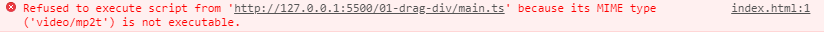
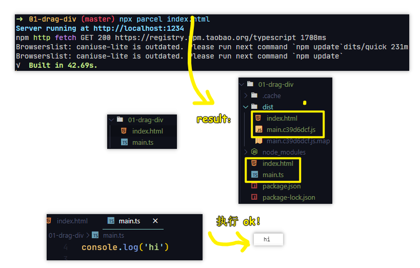
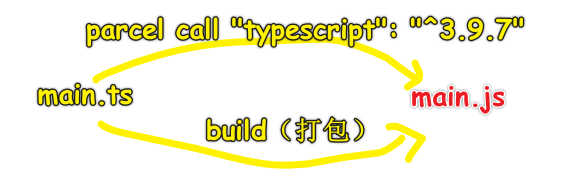
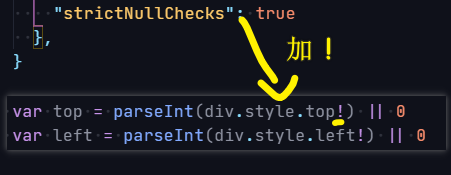

| ✍️ Tangxt | ⏳ 2020-08-10 | 🏷️ 101 |

# 01-TypeScript 入门

## ★制作一个可拖动的 div

> 大概从 2019 年开始，前端可以不用 JS 了 -> 可以用 TypeScript 代替 JS，当然，JS 还是要学的……也许你会疑问不学 JS 直接学 TS 可以吗？ -> 可以的，只是换了一门语言学习罢了，但是你学过 JS 后，再去学 TS，会好学很多……

1）与 JS 的不同

* 编程语言从 JS 直接换成是 TS
* `.js` 换成是 `.ts`
* 由于 ts 不能直接在浏览器运行 -> 所以需要 `build` 一下

2）要做的东西

1. 带着问题看代码
2. `console.log` 调试大法
3. 制作一个可拖拽的 `div`

3）带着问题看代码

* 老师的主体思路是什么？
* 老师遇到问题是如何解决的？
* 老师在哪里查资料？
* 有哪些代码是我没想到的？
  + 为啥要用这个函数？
  + 为啥要处理这个细节？
  + 记下来，以后你就会用了！

4）为什么要制作一个可拖拽的 div？

* 这是一个非常小的项目
  + 它足够简单，每个人都知道如何设计它
  + 它足够全面，你会了解到不同的 JS 知识
  + 它曾是腾讯的机试题

如何做？

* 创建目录
* 写 TS 代码
* 部署

5）让 TS 代码能在浏览器上跑？

1、创建一个安全的「ts-demo-1」目录

2、创建 「index.html」&「main.ts」

``` html
<script src="./main.ts"></script>
```

3、随便添加点 TS（or JS）代码，然后在浏览器运行

结果报错了：



所以，如何让 TS 代码正常跑起来呢？

很简单，直接打包一下就好了：

``` bash
npx parcel index.html
```



> 让 TS 代码能正常运行在浏览器 -> 需要准备很多工具 -> 而这些工具的准备，只需要`npx parcel index.html`一下就能全部自动帮你准备好了！

简单原理：



> parcel 在打包的过程中，用到了「`"typescript": "^3.9.7"`」这个包！
> 
> 用了 parcel 后，你写 css 可以直接使用 sass、less…… -> 后缀是`.scss`……

6）制作一个可拖拽的 div

用 TS 的好处：

- 你可以像写 JS 代码那样写 TS 代码，如不用分号等等……
- 借助 VS Code 的功能，写 TS 代码时，API 提示贼好！ -> 爆红，变量的类型不对头，提示我们要加`px`，如`div.style.top = e.clientY + 'px'`
- TS 没有抹平一个 JS bug，那就是字符串加数字的结果是字符串，而 TS 则认为「凭啥就不能是数字呢？」，所以 `div.style.top += deltaY` 时是咩有爆红的！ -> 为啥说这是 JS 的一个 bug 呢？因为像 Python、Ruby 等，是无法做 `'2'+1` 这样的计算的 -> TS 为了兼容 JS 的 bug，所以就咩有作处理了！
- TS 会告诉你代码哪里错了！而 JS 不会！ -> TS 可以进行类型推导，即便你咩有显示声明这个变量的类型 -> TS 可以告诉你左边的返回值是啥？

一些细节点（为啥要处理这个细节？）：

- `div.style.top`有可能是`'auto'`值！
  - 使用严格模式的 ts -> 配置 `tsconfig.json` -> 官网抄例子
  - `div.style.top!` -> 加个`!`表示`div.style.top`一定会有值（不会是个为空的值），如果没有值，那就搞个兜底值 `div.style.top! || 0`



如果不加 `!`（想让整个 TS 代码看起来都是 JS 代码），那么你可以去掉这行 `"strictNullChecks": true` 配置！

> `"strict":true`是最严格，`"strictNullChecks": true`是严格的空值判断！

整体代码：

``` css
* {
  margin: 0;
  padding: 0;
  box-sizing: border-box;
}

#demo {
  position: absolute;
  top: 0;
  left: 0;
}
```

``` ts
var div = document.createElement('div')
div.style.border = '1px solid red'
div.style.height = '100px'
div.style.width = '100px'
div.id = 'demo'

document.body.appendChild(div)

var x = false

// 根据鼠标的相对位置来做偏移
var position = [0, 0]

div.onmousedown = (e) => {
  x = true
  // 拿到鼠标的位置（只看一屏视口）
  position = [e.clientX, e.clientY]
}

document.onmousemove = (e) => {
  if (x === true) {
    // 如果此时鼠标按压在div上，在拖拽div的过程中，拿到相较于原位置偏移的的 X & Y
    var deltaX = e.clientX - position[0]
    var deltaY = e.clientY - position[1]
    var top = parseInt(div.style.top!) || 0
    var left = parseInt(div.style.left!) || 0
    // 重置div的top & left 值！
    div.style.top = top + deltaY + 'px'
    div.style.left = left + deltaX + 'px'
    // 旧 -> 新 -> 旧 -> 新 -> 如此反复
    position = [e.clientX, e.clientY]
  }
}

document.onmouseup = (e) => {
  x = false
}
```

> 老实说，用了TS，代码提示贼6，当然，如果你用JS的话，最好还是用webstorm……

## ★TS会自动推断类型

