| ✍️ Tangxt | ⏳ 2020-08-10 | 🏷️ 101 |

# 01-TypeScript 入门

## ★制作一个可拖动的 div

> 大概从 2019 年开始，前端就可以不用 JS 了 -> 可以用 TypeScript 代替 JS，当然，JS 还是要学的……也许你会疑问不学 JS 直接学 TS 可以吗？ -> 可以的，只是换了一门语言学习罢了，但是你学过 JS 后，再去学 TS，会好学很多……

### <mark>1）与 JS 的不同</mark>

* 编程语言从 JS 直接换成是 TS
* `.js` 换成是 `.ts`
* 由于 ts 不能直接在浏览器运行 -> 所以需要 `build` 一下

### <mark>2）要做的东西</mark>

1. 带着问题看代码
2. `console.log` 调试大法
3. 制作一个可拖拽的 `div`

### <mark>3）带着问题看代码</mark>

* 老师的主体思路是什么？
* 老师遇到问题是如何解决的？
* 老师在哪里查资料？
* 有哪些代码是我没想到的？
  + 为啥要用这个函数？
  + 为啥要处理这个细节？
  + 记下来，以后你就会用了！

### <mark>4）为什么要制作一个可拖拽的 div？</mark>

* 这是一个非常小的项目
  + 它足够简单，每个人都知道如何设计它
  + 它足够全面，你会了解到不同的 JS 知识
  + 它曾是腾讯的机试题

如何做？

* 创建目录
* 写 TS 代码
* 部署

### <mark>5）让 TS 代码能在浏览器上跑？</mark>

#### <mark>1、创建一个安全的「ts-demo-1」目录</mark>

#### <mark>2、创建 「index.html」&「main.ts」</mark>

``` html
<script src="./main.ts"></script>
```

#### <mark>3、随便添加点 TS（or JS）代码，然后在浏览器运行</mark>

结果报错了：


> `.ts`默认就是视频文件分片的后缀…… -> 所以 ts 文件默认就是视频文件

所以，如何让 TS 代码正常跑起来呢？

很简单，直接打包一下就好了：

``` bash
npx parcel index.html
```


> 让 TS 代码能正常运行在浏览器 -> 需要准备很多工具 -> 而这些工具的准备，只需要`npx parcel index.html`一下就能全部自动帮你准备好了！

简单原理：


> parcel 在打包的过程中，用到了「`"typescript": "^3.9.7"`」这个包！
> 
> 用了 parcel 后，你写 css 可以直接使用 sass、less…… -> 后缀是`.scss`……

### <mark>6）制作一个可拖拽的 div</mark>

用 TS 的好处：

- 你可以像写 JS 代码那样写 TS 代码，如不用分号等等……
- 借助 VS Code 的功能，写 TS 代码时，API 提示贼好！ -> 爆红，变量的类型不对头，提示我们要加`px`，如`div.style.top = e.clientY + 'px'`
- TS 没有抹平一个 JS bug，那就是字符串加数字的结果是字符串，而 TS 则认为「凭啥就不能是数字呢？」，所以 `div.style.top += deltaY` 时是咩有爆红的！ -> 为啥说这是 JS 的一个 bug 呢？因为像 Python、Ruby 等，是无法做 `'2'+1` 这样的计算的 -> TS 为了兼容 JS 的 bug，所以就咩有作处理了！
- TS 会告诉你代码哪里错了！而 JS 不会！ -> TS 可以进行类型推导，即便你咩有显示声明这个变量的类型 -> TS 可以告诉你左边的返回值是啥？

一些细节点（为啥要处理这个细节？）：

- TS 不报错就咩有问题了吗？ -> `div.style.top`有可能是`'auto'`值！
  - 使用严格模式的 ts -> 配置 `tsconfig.json` -> 官网抄例子，搜索「tsconfig.json example」
  - `div.style.top!` -> 加个`!`表示`div.style.top`一定会有值（不会是个为空的值），如果没有值，那就搞个兜底值 `div.style.top! || 0` -> 其实这个报错信息是有问题的，我们知道 `div.style.top` 一定不会为空值，但它爆红了，意味着是有 bug 的！


如果不加 `!`（想让整个 TS 代码看起来都是 JS 代码），那么你可以去掉这行 `"strictNullChecks": true` 配置！

> `"strict":true`是最严格，`"strictNullChecks": true`是严格的空值判断！

整体代码：

``` css
* {
  margin: 0;
  padding: 0;
  box-sizing: border-box;
}

#demo {
  position: absolute;
  top: 0;
  left: 0;
}
```

``` ts
var div = document.createElement('div')
div.style.border = '1px solid red'
div.style.height = '100px'
div.style.width = '100px'
div.id = 'demo'

document.body.appendChild(div)

var x = false

// 根据鼠标的相对位置来做偏移
var position = [0, 0]

div.onmousedown = (e) => {
  x = true
  // 拿到鼠标的位置（只看一屏视口）
  position = [e.clientX, e.clientY]
}

// mousemove 信号是冒泡的 -> down 在 div 上 move 也会发信号给 document
document.onmousemove = (e) => {
  if (x === true) {
    // 如果此时鼠标按压在 div 上，在拖拽 div 的过程中，拿到相较于原位置偏移的的 X & Y
    var deltaX = e.clientX - position[0]
    var deltaY = e.clientY - position[1]
    var top = parseInt(div.style.top!) || 0
    var left = parseInt(div.style.left!) || 0
    // 重置 div 的 top & left 值！
    div.style.top = top + deltaY + 'px'
    div.style.left = left + deltaX + 'px'
    // 旧 -> 新 -> 旧 -> 新 -> 如此反复
    position = [e.clientX, e.clientY]
  }
}

document.onmouseup = (e) => {
  x = false
}
```

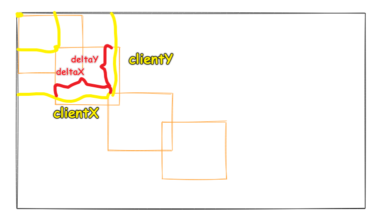

> 老实说，用了 TS，代码提示贼 6，当然，如果你用 JS 的话，最好还是用 webstorm，而不是 VS Code……

## ★TS 会自动推断类型

### <mark>1）TS 的自动推测原理</mark>

1. `var position = [0,0]` -> 根据 `[0,0]` 推测出 `postion`是个 `[number,number]`类型的
2. 你也可以显示声明`position`的类型 -> `var position: [numeber,number]` -> 这表示该数组只能有两个元素，而且必须是 `number` 类型的

如果是 JS，变量随你赋值成什么类型的值！而 TS 则不行，一旦变量一开始就确定了类型，那么之后，你就不能改了！ -> 注意 TS 代码在还未运行的时候，就能静态检测变量的赋值是否合理了！也就是说你在写代码的时候，就能提示你的代码是否写错了！

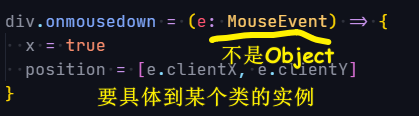

## ★TS 编译成 JS 并部署

### <mark>1）遇到一个 bug</mark>

> parcel 这个极简工具 的存在让我们极大地提高了对 TS 的学习效率，不然要去了解 webpack 的话，又得花费大量的时间去折腾 webpack 这个工具了……

#### <mark>1、如何让我们的代码出现 github 上？</mark>

第一次尝试：

``` bash
npx parcel build
```

打包结果里边，`main.ts & style.css`的文件路径是绝对路径：

我们想要的是：

```
https://xxx.github.io/ts-demo/dist/main.js
```

而结果却是：

```
https://xxx.github.io/main.js
```

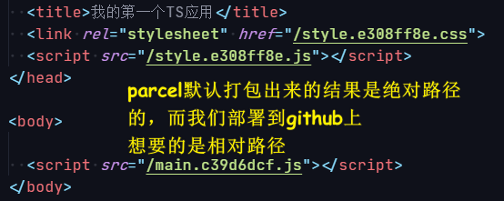

> 方方在上传代码的时候，都会把多余的代码给删了，不然初学者会认为这多余的代码是有用的，而这就会增加初学者的学习负担！

第二次尝试（解决 bug）：

查看 `build` 的帮助文档：

``` bash
npx parcel help build
```

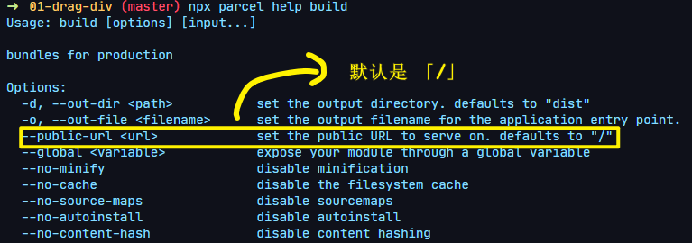

``` bash
npx parcel build --public-url ./ index.html
```

打包结果就是：

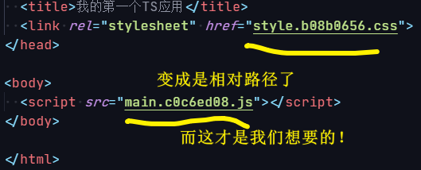

> 如果你想在手机上用手指拖拽，那就用触屏事件，如`touchstart、touchend`，坐标是`touchs[0]`之类的……

➹：[🖥 CLI](https://parceljs.org/cli.html#set-the-public-url-to-serve-on)

## ★总结与答疑

### <mark>1）总结</mark>

- TS 不会写怎么办？ -> 默认自己在用 JS 的姿势写 TS，如果遇到 bus 报错了，那就：
  - 用英文组织关键字
  - 用 Google 搜索
  - 抄-运行-改（CRM 学习法）
- 学 TS 看哪些资料？
  - 官方文档的入门教程，5 分钟上手，例子简单
  - 难点：手册指南 -> 遇到问题再去看……
- `console.log`调试大法
  - 不管你用什么语言
  - 都可以用`log`调试
- TS 推荐你要加分号！
- VSCode 技巧

  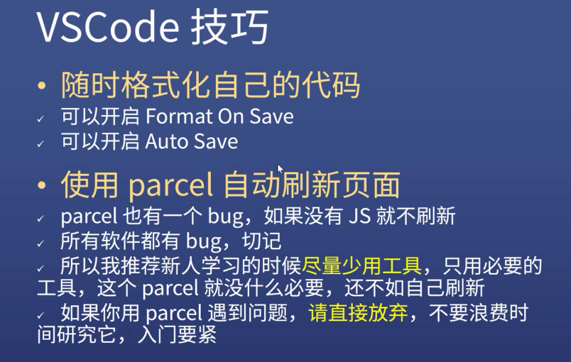

- 项目目的

  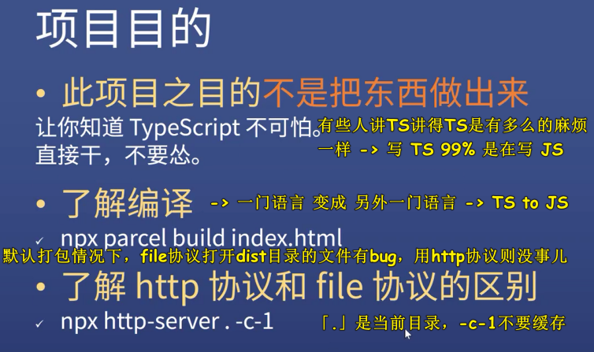

- `div.style.top!` 与 `div.style.top as string` -> 效果一样，用`!`就是缩写！

- 怎么学 TS？

  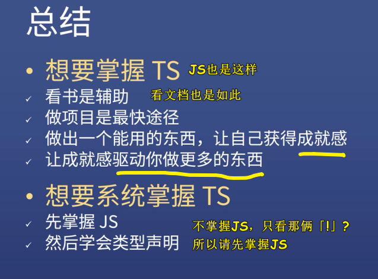

- 如果这节课所学的内容，都忘了？ -> 学习新技术就是直接干，不要怂，遇到`bug`打`log`

  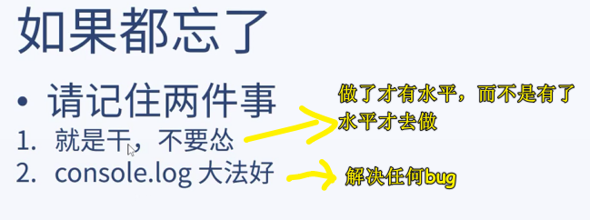

- Node.js 很难吗？你连 TS 都学会了，还怕学 Node.js ？
- 入门一个新东西，能不用工具，就不要用，而这样就不用花费时间去学习工具知识了 -> 保持对学习这个新东西的专注（极简学习法，就如我写笔记，也是用了原生极简的样式） -> 当然，超级好用又简单的工具除外，如 parcel！

### <mark>2）答疑</mark>

#### <mark>1、ECMAScript 规范一更新 TS 就会更新吗？</mark>

理论上，是的，TypeScript = JS + Type

#### <mark>2、TS 的难点？泛型？</mark>

泛型其实就是支持变量的类型

JS 基础打牢了，学习泛型 so easy！

#### <mark>3、遇到不会的需求？</mark>

把 TS 当作 JS 来写，爆红，就 CRM

#### <mark>4、TS 和 JS 的区别？</mark>

主要区别就类型声明！ -> 它还有其它特别有用的特性！

#### <mark>5、TS+React+Antd 的最佳项目实战？</mark>

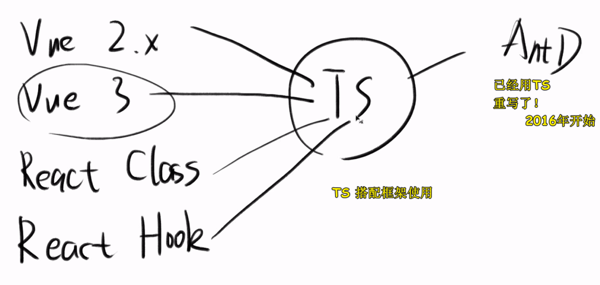

Angular 是 TS 的最佳搭档，但一般我们不用 Angular

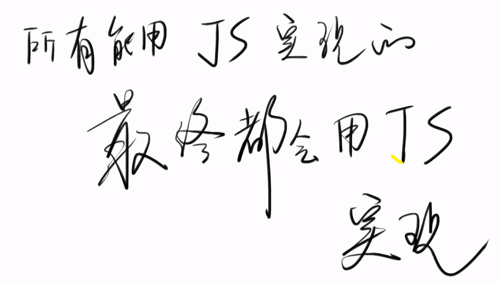

也许以后会有 `IS`……之类的

#### <mark>6、TS 最后会不会跟 C#差不多？</mark>

不会的，你现在看到的 TS 样子就是最终的 TS 样子 -> 也就是说，基本上可以不写类型！

#### <mark>7、C# 与 TS？</mark>

同一个作者 -> 把 C#的精髓带入到了 TS -> 方方以前喜欢 C#，但因为没市场，工资不高，所以就转前端了，当方方学 TS 的时候，就感到 TS 代码非常的眼熟（既有 JS，又有 C#风格的代码）……

#### <mark>8、VSCode 配置 TS 自动加分号？</mark>

装个 prettier 插件，配置一下就好了！
